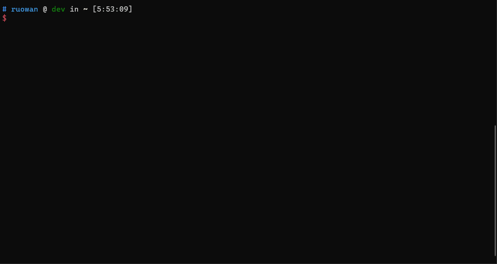

# openapi-validation-tools [oav]

[](https://dev.azure.com/azure-public/adx/_build/latest?definitionId=3)
[](https://github.com/prettier/prettier)

Regression: [](https://dev.azure.com/azure-sdk/public/_build/latest?definitionId=163&branchName=master) [How to fix this](#fixing-regression-builds)

Tools for validating OpenAPI (Swagger) files.

## Requirements

- **node.js version > 10.x**

You can install the latest stable release of node.js from [here](https://nodejs.org/en/download/). For a machine with a linux flavored OS, please follow the node.js installation instructions over [here](https://nodejs.org/en/download/package-manager/)

### How to install the tool

```bash
npm install -g oav@latest
```

#### Command usage:

```bash
$ oav -h    Commands:
  analyze-dependency                        analyze swagger resource type
                                            dependency.
  analyze-report <newman-report-path>       analyze report. default format:
                                            newman json report
  example-quality <spec-path>               Performs example quality validation
                                            of x-ms-examples and examples
                                            present in the spec.
  extract-xmsexamples <spec-path>           Extracts the x-ms-examples for a
  <recordings>                              given swagger from the .NET session
                                            recordings and saves them in a file.
  generate-collection                       Generate postman collection file
                                            from API scenario.
  generate-examples [spec-path]             Generate swagger examples from real
                                            payload records.
  generate-report [raw-report-path]         Generate report from postman report.
  generate-api-scenario                     Generate swagger examples from real
                                            payload records.
  generate-static-api-scenario              Generate API-scenario from swagger.
  generate-uml <spec-path>                  Generates a class diagram of the
                                            model definitions in the given
                                            swagger spec.
  generate-wireformat <spec-path>           Transforms the x-ms-examples for a
                                            given operation into raw
                                            request/response format and saves
                                            them in a markdown file.
  resolve-spec <spec-path>                  Resolves the swagger spec based on
                                            the selected options like allOfs,
                                            relativePaths, examples etc.
  run-api-scenario <api-scenario>           newman runner run API scenario
                                            file.                 [aliases: run]
  validate-example <spec-path>              Performs validation of x-ms-examples
                                            and examples present in the spec.
  validate-spec <spec-path>                 Performs semantic validation of the
                                            spec.
  validate-traffic <traffic-path>           Validate traffic payload against the
  <spec-path>                               spec.

Options:
  --version          Show version number                               [boolean]
  -l, --logLevel     Set the logging level for console.
  [choices: "off", "json", "error", "warn", "info", "verbose", "debug", "silly"]
                                                               [default: "info"]
  -f, --logFilepath  Set the log file path. It must be an absolute filepath. By
                     default the logs will stored in a timestamp based log file
                     at "/home/ruowan/oav_output".
  -p, --pretty       Pretty print
  -h, --help         Show help                                         [boolean]

```

### What does the tool do? What issues does the tool catch?

- Semantic validation
  Semantic validation enforces correctness on the swagger specific elements. Such as paths and operations. Ensure the element definition meet the [OpenApi 2.0 specification](https://nam06.safelinks.protection.outlook.com/?url=https%3A%2F%2Fgithub.com%2FOAI%2FOpenAPI-Specification%2Fblob%2Fmaster%2Fversions%2F2.0.md&data=02%7C01%7Craychen%40microsoft.com%7C8455b2c9dfe54f52d98c08d7cf1aad66%7C72f988bf86f141af91ab2d7cd011db47%7C1%7C0%7C637205585798284783&sdata=zZrZzk4emkODos7%2BqtMT4RG0ipuFiV7uC0lCWeYdRPE%3D&reserved=0).
- Model validation
  Model validation enforces correctness between example and swagger. It checks whether definitions for request parameters and responses, match an expected input/output payload of the service.
  Examples of issues: - required properties not sent in requests or responses; - defined types not matching the value provided in the payload; - constraints on properties not met; enumeration values that don’t match the value used by the service.

      References: https://github.com/Azure/azure-rest-api-specs/issues/778 , https://github.com/Azure/azure-rest-api-specs/issues/755 , https://github.com/Azure/azure-rest-api-specs/issues/773

      Model validation _requires_ example payloads (request/response) of the service, so the data can be matched with the defined models. See [x-ms-examples extension](https://github.com/Azure/azure-rest-api-specs/issues/648) on how to specify the examples/payloads. Swagger “examples” is also supported and data included there is validated as well. To get the most benefit from this tool, make sure to have the simplest and most complex examples possible as part of x-ms-examples.
      - Please take a look at the redis-cache swagger spec as an example for providing "x-ms-examples" over [here](https://github.com/Azure/azure-rest-api-specs/blob/master/arm-redis/2016-04-01/swagger/redis.json#L45).
      - The examples need to be provided in a separate file in the examples directory under the api-version directory `azure-rest-api-specs/arm-<yourService>/<api-version>/examples/<exampleName>.json`. You can take a look over [here](https://github.com/Azure/azure-rest-api-specs/tree/master/arm-redis/2016-04-01/examples) for the structure of examples.
      - We require you to provide us a minimum (just required properties/parameters of the request/response) and a maximum (full blown) example. Feel free to provide more examples as deemed necessary.
      - We have provided schemas for examples to be provided in the examples directory. It can be found over [here](https://github.com/Azure/autorest/blob/master/schema/example-schema.json). This will help you with intellisene and validation.
      - If you are using **vscode** to edit your swaggers in the azure-rest-api-specs repo then everything should work out of the box as the schemas have been added in the `.vscode/settings.json` file over [here](https://github.com/Azure/azure-rest-api-specs/blob/master/.vscode/settings.json).
      - If you are using **Visual Studio** then you can use the urls provided in the settings.json file and put them in the drop down list at the top of a json file when the file is opened in VS.

### How does this tool fit with others

Swagger specs validation could be split in the following:

1. Schema validation
2. Semantic validation
3. Model definition validation
4. Swagger operations execution (against mocked data or live tests)
5. Human-eye review to complement the above

In the context of “azure-rest-api-specs” repo:

- #1 is being performed on every PR as part of CI.
- #2 and #3 are performed by the tool currently in openapi-validation-tools repo and by AutoRest linter. We’re working towards integrating them into CI for “azure-rest-api-specs” repo.
- #4 is not available yet, though we’re starting to work on it.
- #5 will be done by the approvers of PRs in “azure-rest-api-specs”, as this won’t be automated.

### Autorest plugin configuration

- Please don't edit this section unless you're re-configuring how oav plugs in to AutoRest
  AutoRest needs the below config to pick this up as a plug-in - see [Autorest extensions](https://github.com/Azure/autorest/blob/master/docs/developer/architecture/AutoRest-extension.md).

```yaml $(model-validator)
pipeline:
  swagger-document/model-validator:
    input: swagger-document/identity
```

### Run API test

OAV support run API test against Azure and validate request and response. You could define API scenario file which compose with several swagger example files and then use oav to execute it. For more details about API test, please refer to this [API scenario documentation](https://github.com/Azure/azure-rest-api-specs/tree/main/documentation/api-scenario).



### Live Validation Mode

- A **Live Validation** mode has been added to OAV with the purpose of enabling validation of live traffic.
- Usage (here is a sample of a [request-response pair](./test/sampleRequestResponsePair.json)):

```javascript
const liveValidatorOptions = {
  git: {
    url: "https://github.com/Azure/azure-rest-api-specs.git",
    shouldClone: true,
  },
  directory: path.resolve(os.homedir(), "cloneRepo"),
  swaggerPathsPattern: "/specification/**/resource-manager/**/*.json",
  isPathCaseSensitive: false,
  shouldModelImplicitDefaultResponse: true,
};

const apiValidator = new oav.LiveValidator(liveValidatorOptions);
await apiValidator.initialize(); // Note that for a large number of specs this can take some time.

// After `initialize()` finishes we are ready to validate
const validationResult = apiValidator.validateLiveRequestResponse(requestResponsePair);
```

### Regression testing

Output of the OAV tool has been snapshotted and committed to the repo. The regression test may be run on a sample or all of https://github.com/azure/azure-rest-api-specs. If there are changes to the snapshots the build produces a git patch file as an artifact which may be used to update the snapshots.

[Fast Regression (~10mins)](https://dev.azure.com/azure-sdk/public/_build?definitionId=166&_a=completed) is used for merge validation

[Slow Regression (~1 hour)](https://dev.azure.com/azure-sdk/public/_build?definitionId=163&_a=completed) is run after merge and should be fixed if it fails

#### Fixing regression builds

1. Go to the failed build
2. Download the artifact patch file
3. In the OAV directory run `git apply <path to patch file>`
4. Commit the patched changes and create a pull request
5. Validate that the changes look ok and don't represent a breaking change in OAV
6. Merge the PR

---

This project has adopted the [Microsoft Open Source Code of Conduct](https://opensource.microsoft.com/codeofconduct/). For more information see the [Code of Conduct FAQ](https://opensource.microsoft.com/codeofconduct/faq/) or contact [opencode@microsoft.com](mailto:opencode@microsoft.com) with any additional questions or comments.
