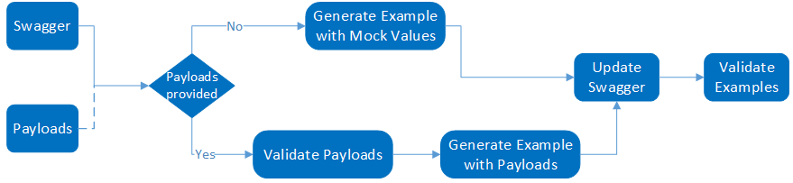

# Using `oav` to generate examples for a `swagger` specification

An example is a JSON file representing the payload of a rest API call, which includes both request information and response information. An example is required to provide for each operation defined in a swagger. `oav` provides a tool to _generate_ examples given an swagger specification and optional REST payloads.

## Pre-requisite

- `oav` installed. Reference the [base readme](../README.md) for a guide on how to install `oav`.
- An operation example is based on the operation defined in a swagger specification. So, a valid swagger is the **pre-requisite** content. 

## Generation Workflow



A video of this process is [available for Microsoft employees.](https://msit.microsoftstream.com/embed/video/f7b90840-98dc-94b1-9e29-f1eba35174a9?autoplay=false&amp;showinfo=true)

## How to run the tool

```bash
oav generate-examples <spec-path>

Params:
  spec-path          the swagger spec file path

Options:
  --version                Show version number                         [boolean]
  -l, --logLevel           Set the logging level for console.
  [choices: "off", "json", "error", "warn", "info", "verbose", "debug", "silly"]
                                                               [default: "info"]
  -f, --logFilepath        Set the log file path. It must be an absolute
                           filepath. By default the logs will stored in a
                           timestamp based log file at
                           "/home/raychen/oav_output".
  -p, --pretty             Pretty print
  -o, --operationId        operation id.                                [string]
  --payload, --payloadDir  the directory path contains payload.         [string]
  -c, --config             the readme config path.                      [string]
  --tag, --tagName         the readme tag name.                         [string]
  -h, --help               Show help                                   [boolean]
```

### Input

| Input | Description |
|---|---|
| **Swagger file path** | Only supports one swagger file. |
| **Swagger readme file path** | Once this value is provided the swagger file path is ignored. This will generate examples for multiple swaggers defined in a specific tag in readme.md. |
| **Tag name in swagger readme file** | The tag name. This value has to be provided when readme file path is provided. |
| **Payloads directory** | Optional input. |

### Output

The generated examples will be dropped at the `examples` sub folder of the folder of swagger file. 
It will generate two types of examples, first type example called `{operationId}_MinimumSet_Gen.json` includes all required properties only and the other type example called `{operationId}_MaximumSet_Gen.json` includes full set of properties.

### Option 1

1. Users only provide the swagger file (or both readme file and tag) as input. 
2. Example generator mock values base on the swagger definition. 
3. Update swagger adding `x-ms-examples` to reference the generated examples.
4. Validate examples against swagger.

```bash
# Note that the Azure/azure-rest-api-specs repo is cloned down prior to invocation

# Example of the command to run against one swagger file: 
oav generate-examples path/to/rest/repo/azure-rest-api-specs/specification/storage/resource-manager/Microsoft.SignalRService/stable/2020-05-01/signalr.json

# Example of the command to run against readme file and tag: 
oav generate-examples --tag=package-2019-06 --config=path/to/rest/repo/azure-rest-api-specs/specification/storage/resource-manager/readme.md
```

### Option 2

1. Users provide both of the swagger file path and payloads directory path of the related operations as input.
2. Example generator runs basic validation for the payloads against the swagger file.
3. Then generate the examples base on the payloads.
4. Update swagger adding `x-ms-examples` to reference the generated examples.
5. Validate examples against swagger.

```bash
# Example of the command to run against one swagger file and provided payloads: 
oav generate-examples path/to/rest/repo/azure-rest-api-specs/specification/storage/resource-manager/Microsoft.SignalRService/stable/2020-05-01/signalr.json --payloadDir=C:/payloads
```

## What's the format of input payloads

Payload directory should contain sub folders named by `[RP_namespace]/[stable|preview]/[api-version]/[operationId]`, for example, `Microsoft.AppPlatform/stable/2020-07-01/SignalR_Get`. Put payload files named by status code under this correspondent folder of `operationId`.

For example,
```bash
.
└── SignalR_Get
    └── 200.json
└── SignalR_CreateOrUpdate
    ├── 201.json
    └── 202.json
```

Payload file should be a valid json file and contains `liveRequest` and `liveResponse`. 
For example,
```json
{
    "liveRequest": {
        "headers": {},
        "method": "PUT",
        "url": "",
        "body": {},
        "query": {}
    },
    "liveResponse": {
        "statusCode": "202",
        "headers": {
        },
        "body": {}
    }
}
```

You can create the payload files by yourself or it can leverage ARM traffic directly, please contact vscswagger@microsoft.com to fetch the traffic payloads.

## Support and questions

Please email vscswagger@microsoft.com.